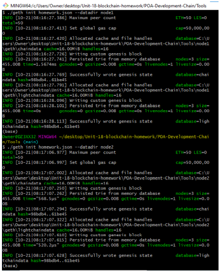

```python
```
# Unit-18-blockchain-homework
## Instructions for Setting up Homeworknet
I generated two new nodes with new account addresses that will serve as our pre-approved sealer addresses using the codes below 

./geth --datadir node1 account new

./geth --datadir node2 account new


Then using the puppet network, I generated my genesis block called homework with the Proof of Authority consensus algorithm.Then I exported the genesis configurations as homework.json files. 


Using geth, I initialized each node with the new homework.json file using the codes below.

	./geth --datadir node1 init homework/homework.json

	./geth --datadir node2 init homework/homework.json



To begin mining blocks, I ran the following commands in separate windows.

./geth --datadir node1 --unlock " 0x54038fCDCF74d71005E6bbeedaDdA4Dfd2F814d1 " --mine --rpc --allow-insecure-unlock

./geth --datadir node2 --unlock " 0xeBDCdB99Bf74cC241a9694bF890420ABF9375710 " --mine --port 30304 --bootnodes "enode://73e951818820f118804918d069f68aa03fed512576e7e2e0391dbf402b8478439036d6da354678cf62cc8f6a93aed82a8911d460e71bd41040ffedb9c3dafd29@127.0.0.1:30303 " --ipcdisable --allow-insecure-unlock

With both nodes up and running, I added the blockchain to MyCrypto by creating a custom network as shown below. 


After connecting to the custom network in MyCrypto, I tested my blockchain by sending money between accounts.


Transaction remained at pending position for most of the time after several refreshing and troubleshooting attempts. 


